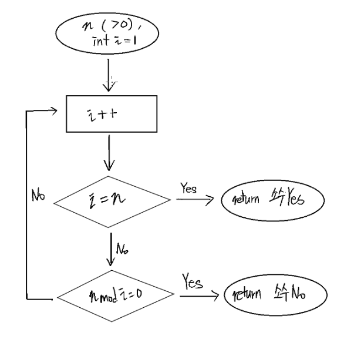
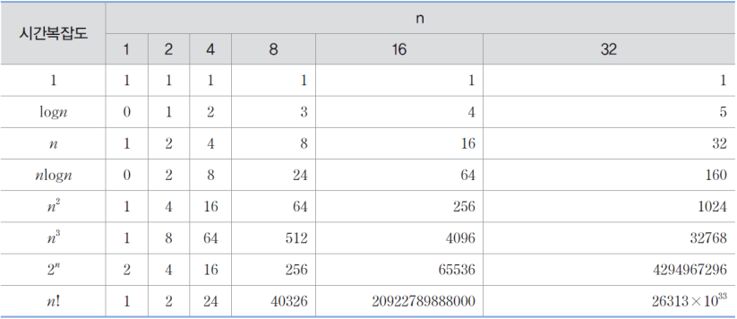
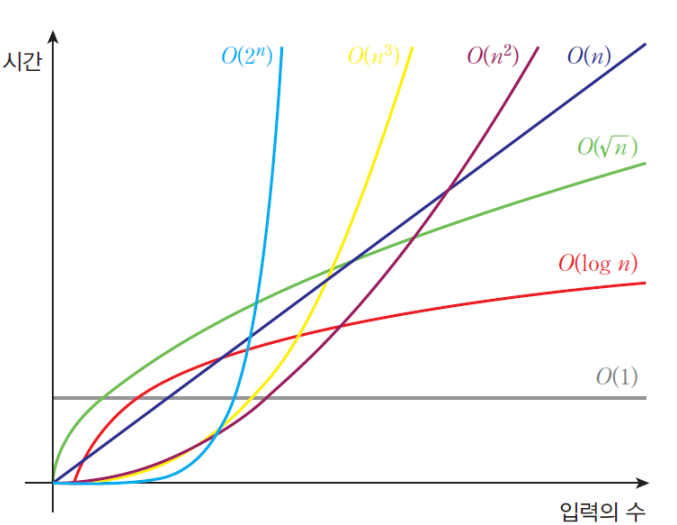
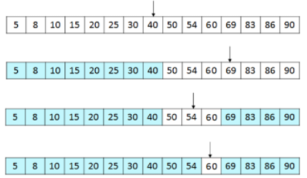

## 자료구조

### 자료구조란?

데이터들의 모임, 데이터 간의 관계. <br>

> ex) 기초자료형(char, ing, float, double), 파생 자료형(배열, 포인터), 사용자 정의 자료형(구조체, 공용체, 열거체), ...

### 삶 속의 자료구조

옷들을 분류하고 정리하는 **옷장**, 책들을 정리하는 **책장** 등<br>
**데이터(자료)들을 모아두는 공간, 장소, 방법**이라고 생각할 수 있다.

---

## 알고리즘

**알고리즘이이란?**

컴퓨터로 문제를 풀기 위한 단계적 절차

> ex) 정렬(Sort), 탐색(Search), 그래프(Graph), ...

### 삶 속의 알고리즘

우리를 최단거리로 안내해주는 **네비게이션**, 우리의 경향성을 파악해 광고하는 **구글 광고** 등<br>
**문제를 풀기위한 방법**이라고 생각할 수 있다.

---

## 자료구조와 알고리즘

> 자료구조 + 알고리즘 = 프로그램

자료구조와 알고리즘은 밀접하게 연관되어 있다.<br>

#### Q. 만약 1부터 10까지 데이터를 저장, 정렬하는 문제가 있다고 가정하자.<br><br>

단순한 int형을 사용해서 구한다면 계속 다른 변수명을 선언해 데이터를 저장하고, 정렬할 것이다.<br>
그러나 배열을 이용한다면 int a[10] 이라고 선언하고, 배열 인덱스를 움직이며 보다 편하게 해결할 수 있다.<br>

> 이처럼 같은 문제를 풀더라도 **효과적인 자료구조, 알고리즘**이 존재한다.<br>
> 그러므로 우리는 문제에 대해 보다 효율적이고 효과적인 자료구조를 택해 해결하는 것이 바람직하다.

---

### 알고리즘 기술 방법

- 영어나 한국어 같은 자연어<br>
- 흐름도(flow chart)<br>
- 유사 코드(pseudo-code)<br>
- 프로그래밍 언어<br>

#### Q. 자연수 n (> 0)이 주어졌을 때, 소수인지 판단하는 알고리즘

영어나 한국어 같은 자연어

> 반복하면서 i의 값을 2부터 n-1까지 증가시켜 n의 값과 나누어 떨어지면 소수가 아님.<br>
> 만약 n이 i로 나누어 떨어지지 않았다면, 소수.

흐름도(flow chart)



유사 코드(pseudo-code)

```
for(i가 n-1이 될 때까지){
  if (n이 i로 나누어 떨어진다면) 소수가 아닙니다.
  else 소수입니다.
}
```

---

## 추상 데이터 타입(ADT: Abstract Data Type)

> 추상 데이터 타입은 데이터와 그 데이터가 어떤 것을 하는지를 포함하고 있다.
> ex) class

우리가 흔히 아는 구조체의 경우, 아래와 같이 여러 자료형들을 담을 수 있다.

```c
#include <stdio.h>

struct A  // 구조체. 자료형
{
    int i;
    int j;
};
```

그러나 추상 데이터 타입은 데이터(자료형) 뿐만 아니라 그 값들의 연산(함수)를 담고 있다.

```c 언어
#include <iostream>

class B // 클래스. 추상 데이터 타입.
{
public:
    int i;
    int j;

    int whichIsBigger(){
        if (i > j)
        {
            return i;
        }
        else {
            return j;
        }
    }
};

```

---

## 시간 복잡도(빅오 : Big-O)

> 알고리즘 성능 비교는 수행 시간 측정, 시간 복잡도(tiem complexity), 공간 복잡도(space complexity)로 비교가능하다.<br>
> 이 때, 중요하지 않은 부분을 제거하고 간단하게 표현한 점근적 표기법(오메가 표기법, 세타 표기법, 빅오 표기법)로 효과적인 비교가 가능하다.<br>
> 아래는 시간복잡도도로 코드의 수행했을 때, 시간을 표로 나타낸 것이다.



실제로 $O(1)$이 단 한 번의 동작만을 하는 것은 아니고, $n$값을 무한으로 가정했을 때, 무시 가능한 상수를 의미한다.<br>
동일하게 $O(n)$ 역시 실제 수행 횟수는 ${4n + 5}$일지라도 무한으로 가정했을 때, 계수와 이하 차수는 무시가능하기에 $O(n)$로 표기한다.<br>
따라서 만약 ${4n^2 + 3n + 7}$라면 $n$이 무한일 때 불필요한 계수와 이차항 이하 항을 무시하고 $O(n^2)$으로 표현가능하다.<br>
마찬가지로 $2n^2 + 3n + 7$회 수행되는 알고리즘의 시간 복잡도는 $O(n^2)$이다.

아래는 빅오 표기법에 대한 시간에 대한 입력의 수($n$)을 그래프로 나타낸 것이다.



---

### 이진 탐색(Binary search)의 빅오 표기법

#### Q. 정렬된 숫자 5개가 주어지고, 찾을 값 n이 주어졌을 때, 어떻게 하면 빠르게 n을 찾을 수 있을까?

가장 쉽게 생각하자면, 첫번째 값부터 순차적으로 n와 비교해보는 것이다.<br>
운이 좋아, 첫번째 값이 검색하려는 값과 동일하다면 1번만에 찾을 수 있을 것이다 $O(1)$<br>
그러나 검색하려는 값이 배열에 없거나, 마지막에 위치한다면 n번만에 찾을 수 있을 것이다.$O(n)$<br>
따라서 Big-O는 $O(n)$이다.<br>

> 운이 좋으면 1번, 운이 나쁘면 n번, 더 효과적인 알고리즘이 없을까?

이진 탐색 알고리즘은 정렬되어 있는 배열에서 검색범위를 줄여가며 검색 값을 찾는 알고리즘이다.<br>
1부터 5까지의 배열이 있다면, $n$값을 찾기 위해 중앙값을 찾아 큰지 작은지 판단하고 작다면 왼쪽 구간에 대해, 크다면 오른쪽 구간에 대해 탐색한다.<br>
중간 값과 찾으려는 값을 값을 찾거나 더 이상 탐색할 수 없을 때 까지 반복한다.<br>

> 만약 정렬되어 있는 15개의 배열 중 60을 찾는다면, 아래와 같이 동작한다.



이진 탐색 알고리즘은 운이 좋으면 $O(1)$, 운이 나빠도 $O(log n)$만에 찾을 수 있다.<br>

> 따라서 Big-O는 $O(log n)$이다.
