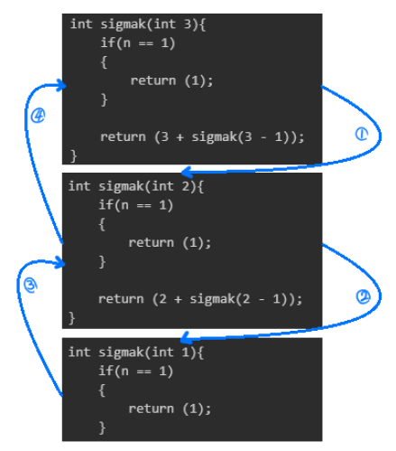
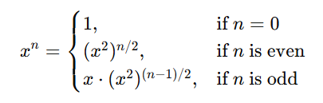
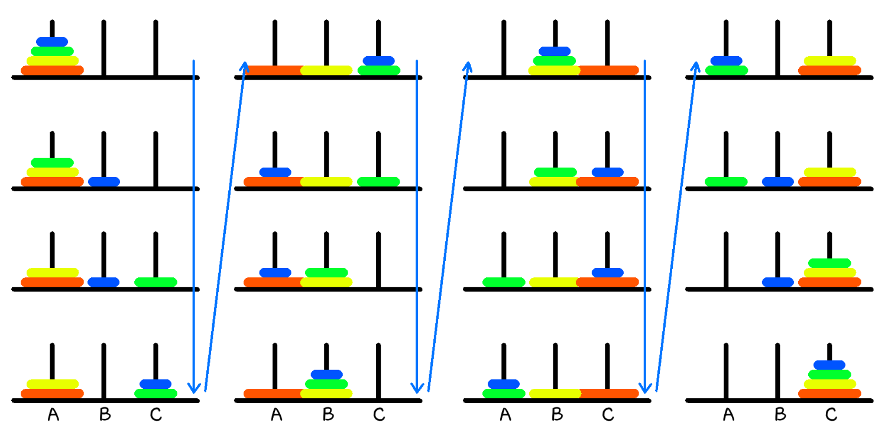

## 순환(Recursion)

### 순환(recursion)이란, 알고리즘이나 함수가 수행 도중에 자기 자신을 다시 호출하여 문제를 해결하는 기법을 의미한다.

> 재귀 함수라고도 불린다.

## 순환과 반복

#### Q. $\sum\limits_{k=1}^n k$를 순환과 반복으로 구해보자.

$\sum\limits_{k=1}^n k$는 n이 주어졌을 때, $1 + 2 + 3 + ... + n$으로 해결 가능하다. <br><br>
이를 코드로 풀이하면 다음과 같이 나타낼 수 있다.

#### 순환을 이용한 $\sum\limits_{k=1}^n k$

```
#include <stdio.h>

int sigmak(int n){
    if(n == 1)
    {
        return (1);
    }

    return (n + sigmak(n - 1));
}
```

#### 반복을 이용한 $\sum\limits_{k=1}^n k$

```
#include <stdio.h>

int main(){

    int n = 0;
    int ans = 0;

    scanf("%d", &n);

    for (int i = 1; i >= n; i++)
    {
        ans = ans + 1;
    }

    return 0;
}
```

둘 다 동일한 작업을 수행할 수 있지만, 순환의 경우 함수 영역 + 돌아갈 곳의 주소 + $@$ 를 계속 가지기 때문에 오버헤드와와 메모리 사용량이 크다. 메모리와 속도 면에서 반복에 비해 좋지 않기 때문에 임베디드시스템 등에서는 잘 사용하지 않는다.<br>



> 따라서 반복으로 가능하다면 순환보다는 반복을 사용하는 것이 좋다.

---

#### Q. $x^n$을 순환으로 구현하자.

거듭제곱 $x^3$ 풀어서 쓰면 $x * x * x$로 나타낼 수 있다. 주어진 n(제곱근)의 수 만큼 곱하면, $O(n)$으로 $x^n$을 구할 수 있다.<br><br>
이를 코드로 하면 아래와 같다.

```
#include <stdio.h>

int power(int x, int n)
{
    if(n == 0)
    {
        return 1;
    }
    else
    {
        return x * power(x, n - 1);
    }
}
```

> Q. $O(n)$보다 더 빠른 코드가 없을까? <br>

단순히 $x*x*...*x$ 반복하는 것이 아닌 주어진 $n$이 짝수인지 홀수인지에 따라 $n$을 절반씩 줄여가며 순환적인 방법으로 1(탈출조건)에 도달하게 할 수 있다. <br>



이를 코드로 표현하면 아래와 같다. $O(log n)$으로 동작한다.

```
#include <stdio.h>

int power(int x, int n)
{
    if(n == 0)
    {
        return 1;
    }
    else if ((n % 2) == 0 )
    {   // n == 짝수
        return power(x * x, n / 2);
    }
    else
    {   // n == 홀수
        return x * power(x * x, (n - 1) / 2);
    }
}
```

---

#### Q. Fibonacci 수열

피보나치 수열은 n번째 값을 구할 때, (n-1)번째 값과 (n-2)번째 값의 합으로 나타낼 수 있다.<br><br>
이를 코드로 표현하면 아래와 같다.

```
#include <stdio.h>

int fibonacci(int n) {

	if (n == 0) {
		return 0;
	}
	if (n == 1) {
		return 1;
	}
	return fibonacci(n - 2) + fibonacci(n - 1);
}
```

> 지금 피보나치 수열은 불필요한 부분이 존재한다.<br>
> 다음 그림에서 색칠된 부분을 확인해보자.


순환 과정에서 동일한 함수를 부르는 불필요한 과정이 존재한다. 이를 어떻게하면 해결가능할까? <br><br>
간단하다. 배열을 통해 중복되는 함수를 저장해두고, 함수를 호출하지 않고 바로 값을 리턴하자.<br><br>
이를 코드로 하면 아래와 같다.

```
#include <stdio.h>
#define SIZE 100

int fibo_list[SIZE] = { 0, };

int fibonacci(int n)
{
    if (n == 0) {
		return 0;
	}
	if (n == 1) {
		return 1;
	}

    if (fibo_list[n] != 0)
    {
        return fibo_list[n];
    }

    fibo_list[n] = fibonacci(n - 1) + fibonacci(n - 2);

    return fibo_list[n];
}
```

> 이전의 순환만을 이용한 코드가 $O(2^n)$이었지만, 배열을 이용한다면 $O(n)$으로 효율적으로 계산가능하다.

---

#### Q. 하노이의 탑

하노이의 탑은 3개의 기둥 중 한쪽에 원판을 쌓아두고, 다른 쪽으로 모두 옮기는 게임이다.<br>
위에 작은 원판을 치우지 않으면 아래의 원판을 옮기지 못하기 때문에 원판이 위치한 기둥과 옮기려는 기둥 외에 임시 기둥을 통해 이동시키는 것이 관건이다.<br><br>
원판이 4개인 경우를 그림을 통해 살펴보자.



이처럼 A기둥에서 C기둥으로 모두 옮기기 위해서는 B기둥을 이용해 작은 원판들을 치워두고, 큰 원판부터 C로 옮겨야 한다.<br>
하노이의 탑은 원판 수에 따라 2개일 때, 3번을, 3개일 때, 7번을, 그리고 그림과 같이 4개일 때, 15번 옮기면 최소한의 움직임으로 해결가능하다.<br>

> 이를 통해 우리는 하노이의 탑의 최소이동횟수가 $2^n - 1$임을 알 수 있다.

하노이의 탑을 코드로 표현한다면 아래와 같다.

```
void hanoi(int _n, char _src, char _dst, char _temp)
{
    if( _n == 1 )
    {
        printf("원판을 %c 에서 %c으로 옮긴다.\n", _src, _dst);
    }
    else
    {
        hanoi(_n - 1, _src, _temp, _dst);
        printf("원판을 %c에서 %c으로 옮긴다.\n", _src, _dst);
        hanoi(_n - 1, _temp, _dst, _src);
    }
}
```

#### Q. 하노이의 탑 원반이 100개라면?

A. 하노이의 탑의 최소이동횟수는 $2^n - 1$이므로 $n$에 100을 넣으면<br>

#### $1,267,650,600,228,229,401,496,703,205,375$

1경 2676조 5060억 0228만 2294천 0149 이라는 말도 안되는 숫자가 나온다.<br>
만약 1번의 이동 횟수에 1나노초(nano-second)가 걸린다고 가정한다면,<br>
약 40조 1757억 4664만 2538년이라는 우주의 나이(약 138억 년)보다 훨씬 긴 시간이 걸린다.
