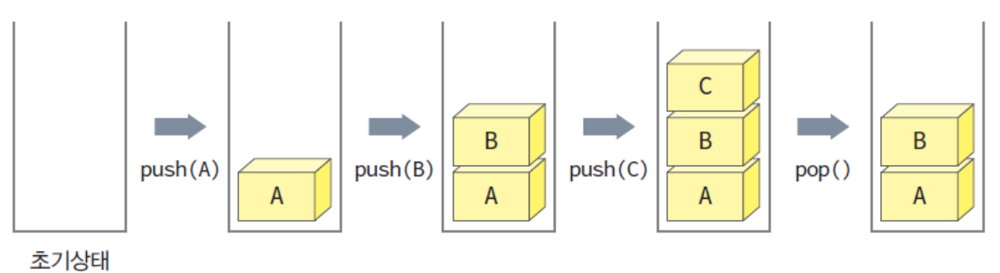
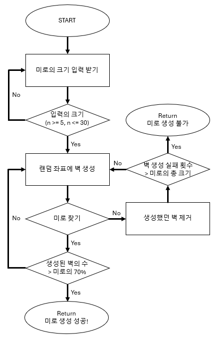

## 스택

### 스택이란, 쌓아놓은 더미를 의미한다.

### 스택의 특징, 후입선출(LIPO: Last-in First-out)

#### 가장 최근에 들어온 데이터가 가장 먼저 나간다.


push()에 데이터를 쌓고, pop()에 내보내고 있다.<br>
이를 코드로 나타내면 아래와 같다.

```c
#include <stdio.h>

int stack[5];
int top = -1;

int isEmpty(){
    return (top == -1);
}

int isFull(){
    return (top == 4);
}

void push(int value){

    if (isFull() > 0)
    {
        return; // 꽉 찼으면 못 넣는다.
    }

    top++;
    stack[top] = value;
}

int pop(){

    if (isEmpty() > 0)
    {
        return -999;    // 비어있다는 의미로 -999 반환
    }

    int result = stack[top];
    top--;

    return result;
}

int main(){

    return;
}
```

---

### 스택의 활용

스택을 이용하면 후위계산식을 풀이하거나, 괄호를 짝지어 체크하는 문제 등 스택의 특성을 이용해 다양한 문제를 효과적으로 풀이 가능하다.<br>
아래는 스택으로 백트래킹으로 길찾기 알고리즘을 구현해 미로 만들기 문제를 풀이하겠다.

---

### 미로만들기

다음 조건을 만족하며, 문제를 풀어보자.

1. 미로의 크기 n 입력 받기 (n >= 5, n <= 30)
2. 미로의 표기: 1은 벽 0은 통로
3. 시작지점은 (0,0), 도착지점은 (n-1, n-1)
4. random 함수를 이용해 벽을 임의의 위치에 생성
5. 미로 길찾기 알고리즘을 이용해 경로 파악
6. 경로가 있으면 4번 / 없다면 4번에서 만든 벽을 지우고 다시 4번
7. (n \* n)의 미로의 70% 이상이 벽이 될 때까지 위 과정 반복.
8. 미로 완성본 출력

과정을 플로우 차트로 간단하게 그리면 다음과 같다.


---

#### 입력받기

문제를 풀기 위해 먼저 입력을 받아야 한다.<br>
입력은 (n >= 5, n <= 30)으로 사용자에 따라 바뀌기 때문에 이전 챕터에 나왔던 동적할당을 이용하겠다.

```c
// 좌표 정보를 나타내는 구조체
struct COORD{
  int row;
  int col;
};

struct COORD path_stack = NULL;     // 스택(경로 저장)
struct COORD visited = NULL;        // 방문한 좌표 저장
int **maze = NULL;                  // 미로
int top = -1;                       // path_stack의 top
int visitedIndex = -1;              // visited의 index
int size = 0;                       // 미로의 크기 ( size * size )
int wallcount = 0;                  // 생성된 벽의 수

int main() {

  scanf("%d", &size);

  struct COORD start_point = { 0, 0 };                // 시작지점
  struct COORD dest_point = { size - 1, size -1 };    // 종료지점

  // 미로와 문제풀이에 사용할 스택과 배열 동적할당.
  maze = (int **)malloc(size * sizeof(int *));

  for (int i = 0; i < size; i++)
  {
    maze[i] = (int *)malloc(size * sizeof(int));
  }

  path_stack = (struct COORD *)malloc(size * size * sizeof(struct COORD));
  visited = (struct COORD *)malloc(size * size * sizeof(struct COORD));

  // 랜덤 시드 값
  srand(time(NULL));

  // 미로 초기화 모두 0으로
  for (int i = 0; i < size; i++)
  {
    for (int j = 0; j < size; j++)
    {
      maze[i][j] = 0;
    }
  }

  // 동적할당 해제
  for (int i = 0; i < size; i++)
  {
    free(maze[i]);
  }
  free(maze);

  free(path_stack);
  free(visited);

    return 0;
}
```

동적할당을 통해 미로의 크기를 받아 사용할 변수들에 크기를 선언해주었다. <br>
미로를 더블 포인터가 아닌 싱글 포인터로 `maze = (int *)malloc(size * size * sizeof(int));`로 사용 가능하지만 그렇게하면 이후에 `maze(row * size + col)`같은 형태로 사용해야 해서 더블 포인터를 이용해 2차원 배열처럼 만들어 주었다.

---

#### 미로 길찾기 알고리즘

우리가 가장 쉽게 생각할 수 있는 미로의 길 찾기는 한칸씩 움직이며 3가지를 고려하는 것이다.<br>
지도 영역 내인지? 벽이 있는지? 이미 가본 적 있는 길인지? 이 세 가지를 4방향으로 고려해보자.<br>
상하좌우를 각각 3가지를 고려한다면, 다음에 어떤 위치로 가야하는지 알 수 있다.<br>
이를 코드로 표현하면 다음과 같다.

```c
// 스택 관련 함수
int isStackEmpty(){
  return (top == -1);
}

int isStackFull(){
  return (top == (size * size - 1));
}

void push(struct COORD _c){
  if (isStackFull())
  {
  return;
  }
  top++;
  path_stack[top] = _c;
  return;
}

struct COORD pop(){

  struct COORD result = { -1, -1 };

  if (isStackEmpty())
  {
  return result;
  }

  result = path_stack[top];
  top--;
  return result;
}

// peek (pop과 유사하지만 실제로 pop은 하지 않고 맨 위의 값을 보기만 함.)
struct COORD peek(){
  struct COORD result = { -1, -1 };

  if (isStackEmpty())
  {
  return result;
  }

  result = path_stack[top];
  return result;
}

// 길찾기 관련 함수

// 좌표 _c를 방문했었는지 판단
// 했었으면 1 아니면 zero
int checkVisited(struct COORD _c){
  for (int i = 0; i <= visitedIndex; i++)
  {
    if (visited[i].col == _c.col && visited[i].row == _c.row)
    {
      return 1;
    }
  }

  return 0;
}

void addToVisited(struct COORD _c){

  // 있는지를 검사한다.
  // 없으면 추가한다. 이때 인덱스를 먼저 증가시킨다.
  if (checkVisited(_c) == 0){
    visitedIndex++;
    visited[visitedIndex] = _c;
  }
}

// _c가 _dst와 같은지 판단.
// 같으면 non-zero를 반화, 아니면 0을 반환
int checkDestination(struct COORD _c, struct COORD _dst){
  return (_c.row == _dst.row && _c.col == _dst.col);
}

// _c가 영역 내에 있으면 1, 아니면 0
int isWithinMap(struct COORD _c){
  return ((_c.row >= 0) && (_c.row < size) && (_c.col >= 0) && (_c.col < size));
}

int isWall(struct COORD _c){
  return (1 == maze[_c.row][_c.col]);
}

// _c를 기준으로 갈 수 있는 좌표 1곳을 반환
// 만약 없으면 (-1, -1) 반환
struct COORD findWhereToGo(struct COORD _c){

  // 체크할 방향을 저장하는 변수
  struct COORD target;

  // 위
  target.row = _c.row - 1;
  target.col = _c.col;

  // 1. 지도 영역 내인가?
  // 2. 벽인가?
  // 3. 가본 적 있나?
  if (isWithinMap(target) == 1 && isWall(target) == 0 && checkVisited(target) == 0)
  {
    return target;
  }

  // 아래
  target.row = _c.row + 1;
  target.col = _c.col;

  if (isWithinMap(target) && !isWall(target) && !checkVisited(target))
  {
    return target;
  }

  // 왼쪽
  target.row = _c.row;
  target.col = _c.col - 1;

  if (isWithinMap(target) && !isWall(target) && !checkVisited(target))
  {
    return target;
  }

  // 오른쪽
  target.row = _c.row;
  target.col = _c.col + 1;

  if (isWithinMap(target) && !isWall(target) && !checkVisited(target))
  {
    return target;
  }

  target.row = -1;
  target.col = -1;

  return target;
}

// _s에서 _d까지 경로를 출력하는 함수
void findPath(struct COORD _s, struct COORD _d, struct COORD _wall){

  // 현재 위치를 설정
  struct COORD current = _s;

  // 출발 좌표 저장
  addToVisited(current);

  while(1)
  {
    // 현재 위치에서 가는 곳을 찾는다.
    struct COORD whereToGO = findWhereToGo(current);

    if (whereToGO.row != -1 && whereToGO.col != -1)
    {   // 갈 곳이 있음
      push(current);  // 경로를 저장해 둔다.
      current = whereToGO;  // current는 항상 현재 위치를 표시

      addToVisited(current);  // 내가 여기 왔다고 표시

      if (checkDestination(current, _d) == 1)
      {
        // 도착. stack에 들어있는 경로 출력
        // 이후 미로 만들기에서는 수정될 부분.
        for (int i = 0; i <= top; i++)
        {
          printf("( %d, %d )\n", path_stack[i].row, path_stack[i].col);
        }

        printf("목적지 도착! (%d, %d)\n", current.row, current.col);
        return;
      }
    }
    else
    {   // 갈 곳이 없음
      while (1)
      {
        // top_coord <= stack의 맨 위에 있는 곳을 peek
        struct COORD top_coord = peek();

        // top_coord (-1, -1) : stack이 비었음... 경로 없음
        // 더 이상 돌아갈 곳이 없음. 프로그램 종료.
        if (top_coord.row == -1 && top_coord.col == -1)
       {
          // 이후 미로 만들기에선는 수정될 부분.
          printf("경로가 없습니다.\n");
          return;
        }

        whereToGO = findWhereToGo(top_coord);

       if (whereToGO.row == -1 && whereToGO.col == -1)
       {
          // findWhereToGo(top_coord) => (-1, -1)
          // 이 좌표는 도움이 안됨. 더 이전으로 가야함. 이 좌표는 버림
          pop();  // top_coord를 날려버림.
        }
        else
        {
          // findWhereToGo(top_coord) => 유효한 좌표 찾기 성공
          // current = whereToGo
          // push가 필요 없음, 아직 top_coord가 스택에 존재하기 때문.
          // addToVisited(current)
          current = whereToGO;
          addToVisited(current);
          break;
        }
      }
    }
  }
}
```

조건들을 이용해 갈 수 있는 좌표를 찾고, 없다면 스택을 이용해 백트래킹으로 돌아와 다시 좌표를 찾을 수 있다.<br>
이 코드를 통해 우리는 시작 위치에서 도착 위치까지의 경로를 찾을 수 있다.

---

#### 벽 생성

랜덤한 위치에 벽을 생성해야되기 때문에 `rand()`함수와 시드값으로 `time()` 함수를 쓰기 위해 `#include <stdlib.h>`와 `#include <time.h>`을 추가하고, 랜덤하게 벽을 생성해주었다.

```c
// 벽 생성 관련 함수

// 생성된 벽이 중복인지 확인. 같은 벽이면 1, 아니면 0
int check_create_wall(struct COORD _wall){
  if (maze[_wall.row][_wall.col] == 1){
    return 1;
  }
  else
  {
    return 0;
  }
}

// 랜덤한 위치에 벽을 하나 생성.
struct COORD create_wall(){
  struct COORD wall;

  // 0 ~ size -1 까지 중에 랜덤
  wall.row = rand() % size;
  wall.col = rand() % size;

  while (1)
  { // 이미 생성된 벽이거나 출발 위치이거나 도착 위치인 경우, 재생성.
    if (check_create_wall(wall) == 1 || (wall.row == 0 && wall.col == 0) || (wall.row == size - 1 && wall.col == size - 1))
    {
      wall.row = rand() % size;
      wall.col = rand() % size;
    }
  else
    { // 벽 생성
      maze[wall.row][wall.col] = 1;
      wallcount++;
      break;
    }
  }

  return wall;
}
```

---

#### 문제점 수정

70% 이상의 벽을 생성하는데에 있어. $5 * 5$와 $6 * 6$ 사이즈는 말이 안된다. <br>
$5 * 5$ 의 70%는 $17.5$로 $17.5$ 이상 벽을 세운다면 $18$개 이상을 세워야 한다.<br>
그런데 $5 * 5$일때 최소한의 이동은 가로로 5번 세로로 4번 움직인 9번의 움직임이 필요하다.<br>
$18 + 9$ 는 $27$로 $5 * 5$ 배열의 개수인 25를 넘어버린다.<br>
$6 * 6$ 사이즈의 미로 역시 마찬가지이다.<br>
$6 * 6$ 사이즈의 미로에서 70%는 25.2로 25.2 이상의 벽을 세운다면 26개 이상 세워야 한다.<br>
미로의 최소 이동 수는 $6 + 5$로 $11$ 이므로 $26 + 11 \neq 6 * 6$ 이다.<br>
따라서 $5$와 $6$인 경우 미로를 만들 수 없다.<br><br>
`failcount`를 만들어 size \* size번 경로를 찾지 못하면, 더이상 벽을 세울 수 없기에 "경로를 찾을 수 없습니다." 메세지를 띄우게 하였다.<br><br>

---

#### 최종 코드

아래는 최종코드이다.<br>
통로는 'O', 벽은 'X', 경로는 'P'로 표시했다.

```c
#include <stdio.h>
#include <stdlib.h>
#include <time.h>

// 좌표 정보를 나타내는 구조체
struct COORD{
  int row;
  int col;
};

struct COORD *path_stack = NULL;    // 스택(경로 저장)
struct COORD *visited = NULL;       // 방문한 좌표 저장
int **maze = NULL;                  // 미로
int top = -1;                       // path_stack의 top
int visitedIndex = -1;              // visited의 index
int size = 0;                       // 미로의 크기 ( size * size )
int wallcount = 0;                  // 생성된 벽의 수
int failcount = 0;                  // 5와 6를 걸러내기 위한 경로탐색실패 카운트

// 스택 관련 함수
int isStackEmpty(){
  return (top == -1);
}

int isStackFull(){
  return (top == (size * size - 1));
}

void push(struct COORD _c){
  if (isStackFull())
  {
  return;
  }
  top++;
  path_stack[top] = _c;
  return;
}

struct COORD pop(){

  struct COORD result = { -1, -1 };

  if (isStackEmpty())
  {
  return result;
  }

  result = path_stack[top];
  top--;
  return result;
}

// peek (pop과 유사하지만 실제로 pop은 하지 않고 맨 위의 값을 보기만 함.)
struct COORD peek(){
  struct COORD result = { -1, -1 };

  if (isStackEmpty())
  {
  return result;
  }

  result = path_stack[top];
  return result;
}

// 길찾기 관련 함수

// 좌표 _c를 방문했었는지 판단
// 했었으면 1 아니면 zero
int checkVisited(struct COORD _c){
  for (int i = 0; i <= visitedIndex; i++)
  {
    if (visited[i].col == _c.col && visited[i].row == _c.row)
    {
      return 1;
    }
  }

  return 0;
}

void addToVisited(struct COORD _c){

  // 있는지를 검사한다.
  // 없으면 추가한다. 이때 인덱스를 먼저 증가시킨다.
  if (checkVisited(_c) == 0){
    visitedIndex++;
    visited[visitedIndex] = _c;
  }
}

// _c가 _dst와 같은지 판단.
// 같으면 non-zero를 반화, 아니면 0을 반환
int checkDestination(struct COORD _c, struct COORD _dst){
  return (_c.row == _dst.row && _c.col == _dst.col);
}

// _c가 영역 내에 있으면 1, 아니면 0
int isWithinMap(struct COORD _c){
  return ((_c.row >= 0) && (_c.row < size) && (_c.col >= 0) && (_c.col < size));
}

int isWall(struct COORD _c){
  return (1 == maze[_c.row][_c.col]);
}

// _c를 기준으로 갈 수 있는 좌표 1곳을 반환
// 만약 없으면 (-1, -1) 반환환
struct COORD findWhereToGo(struct COORD _c){

  // 체크할 방향을 저장하는 변수
  struct COORD target;

  // 위
  target.row = _c.row - 1;
  target.col = _c.col;

  // 1. 지도 영역 내인가?
  // 2. 벽인가?
  // 3. 가본 적 있나?
  if (isWithinMap(target) == 1 && isWall(target) == 0 && checkVisited(target) == 0)
  {
    return target;
  }

  // 아래
  target.row = _c.row + 1;
  target.col = _c.col;

  if (isWithinMap(target) && !isWall(target) && !checkVisited(target))
  {
    return target;
  }

  // 왼쪽
  target.row = _c.row;
  target.col = _c.col - 1;

  if (isWithinMap(target) && !isWall(target) && !checkVisited(target))
  {
    return target;
  }

  // 오른쪽
  target.row = _c.row;
  target.col = _c.col + 1;

  if (isWithinMap(target) && !isWall(target) && !checkVisited(target))
  {
    return target;
  }

  target.row = -1;
  target.col = -1;

  return target;
}

// _s에서 _d까지 경로를 출력하는 함수
void findPath(struct COORD _s, struct COORD _d, struct COORD _wall){

  // 현재 위치를 설정
  struct COORD current = _s;

  // 출발 좌표 저장
  addToVisited(current);

  while(1)
  {
    // 현재 위치에서 가는 곳을 찾는다.
    struct COORD whereToGO = findWhereToGo(current);

    if (whereToGO.row != -1 && whereToGO.col != -1)
    {   // 갈 곳이 있음
      push(current);  // 경로를 저장해 둔다.
      current = whereToGO;

      addToVisited(current);

      if (checkDestination(current, _d) == 1)
      {
        // 도착.
        return;
      }
    }
    else
    {   // 갈 곳이 없음
      while (1)
      {
        // top_coord <= stack의 맨 위에 있는 곳을 peek
        struct COORD top_coord = peek();

        // top_coord (-1, -1) : stack이 비었음... 경로 없음
        // 더 이상 돌아갈 곳이 없음. 프로그램 종료.
        if (top_coord.row == -1 && top_coord.col == -1)
       {
          maze[_wall.row][_wall.col] = 0;   // 벽 지우기
          wallcount--;
          failcount++;  // 실패 카운트
          return;
        }

        whereToGO = findWhereToGo(top_coord);

       if (whereToGO.row == -1 && whereToGO.col == -1)
       {
          // findWhereToGo(top_coord) => (-1, -1)
          // 이 좌표는 도움이 안됨. 더 이전으로 가야함. 이 좌표는 버림
          pop();  // top_coord를 날려버림.
        }
        else
        {
          // findWhereToGo(top_coord) => 유효한 좌표 찾기 성공
          // current = whereToGo
          // push가 필요 없음, 아직 top_coord가 스택에 존재하기 때문.
          // addToVisited(current)
          current = whereToGO;
          addToVisited(current);
          break;
        }
      }
    }
  }
}

// 벽 생성 관련 함수

// 생성된 벽이 중복인지 확인. 같은 벽이면 1, 아니면 0
int check_create_wall(struct COORD _wall){
  if (maze[_wall.row][_wall.col] == 1){
    return 1;
  }
  else
  {
    return 0;
  }
}

// 랜덤한 위치에 벽을 하나 생성.
struct COORD create_wall(){
  struct COORD wall;

  // 0 ~ size -1 까지 중에 랜덤
  wall.row = rand() % size;
  wall.col = rand() % size;

  while (1)
  { // 이미 생성된 벽이거나 출발 위치이거나 도착 위치인 경우, 재생성.
    if (check_create_wall(wall) == 1 || (wall.row == 0 && wall.col == 0) || (wall.row == size - 1 && wall.col == size - 1))
    {
      wall.row = rand() % size;
      wall.col = rand() % size;
    }
  else
    { // 벽 생성
      maze[wall.row][wall.col] = 1;
      wallcount++;
      break;
    }
  }

  return wall;
}

// 미로 보여주기
void show_maze(){
  for (int i = 0; i < size; i++)
  {
    for (int j = 0; j < size; j++)
    {
      if (maze[i][j] == 1)
      { // 벽 그리기.
        printf("X");
      }
      else if (maze[i][j] == 0)
      { // 통로 그리기.
        printf("O");
      }
      else if (maze[i][j] == 3)
      { // 경로 그리기.
        printf("P");
      }
    }
    printf("\n");
  }
  printf("\n");

  return;
}

// 경로 보여주기
void show_path(){
  for (int i = 0; i <= top; i++)
    { // 경로를 3으로 표시
      maze[path_stack[i].row][path_stack[i].col] = 3;
    }

  show_maze();

  return;
}

// 미로 만들기
int create_maze(struct COORD _s, struct COORD _d){

    while ((size * size * 7) / 10 >= wallcount)
    {
    // 스택, 배열 초기화
    top = -1;
    visitedIndex = -1;

    struct COORD wall = create_wall();
    findPath(_s, _d, wall);

    // 최소이동횟수( size + size - 1 )을 제외한 벽의 최대수를 충족하고 충분히 많이 실패한 경우.
    // 조건을 충족하는 미로를 만들 수 없는 경우.
    if ((failcount > size * size) && (wallcount == (size * size) - (size + size - 1)))
    {
        printf("경로를 찾을 수 없습니다.\n");
        printf("미로를 완성할 수 없습니다.\n");
        return 0;
    }

  }
  return 1;
}

int main() {
  int n = 0;

  printf("미로의 크기를 정해주세요.(n >= 5, n <= 30)\n");
  scanf("%d", &size);

  struct COORD start_point = { 0, 0 };                // 시작지점
  struct COORD dest_point = { size - 1, size -1 };    // 종료지점

  // 미로와 문제풀이에 사용할 스택과 배열 동적할당.
  maze = (int **)malloc(size * sizeof(int *));

  for (int i = 0; i < size; i++)
  {
    maze[i] = (int *)malloc(size * sizeof(int));
  }

  path_stack = (struct COORD *)malloc(size * size * sizeof(struct COORD));
  visited = (struct COORD *)malloc(size * size * sizeof(struct COORD));

  // 랜덤 시드 값
  srand(time(NULL));

  // 미로 초기화 모두 0으로
  for (int i = 0; i < size; i++)
  {
    for (int j = 0; j < size; j++)
    {
      maze[i][j] = 0;
    }
  }

  // 미로 생성
  if (create_maze(start_point, dest_point))
  { // 성공!
    printf("(%d * %d)사이즈의 미로\n", size, size);
    show_maze();

    printf("경로를 보고 싶다면 1을 종료는 2를 눌러주세요.\n");
    scanf("%d", &n);

    if (n == 1)
    {
      show_path();
    }
  }
  else
  { // 실패
    show_maze();
    printf("현재 미로에서 더 이상 벽을 추가할 수 없습니다.\n");
  }

  printf("아무 버튼을 입력해 종료해주세요.\n");
  scanf("%d", &n);

  // 동적할당 해제
  for (int i = 0; i < size; i++)
  {
    free(maze[i]);
  }
  free(maze);

  free(path_stack);
  free(visited);

  return 0;
}
```
